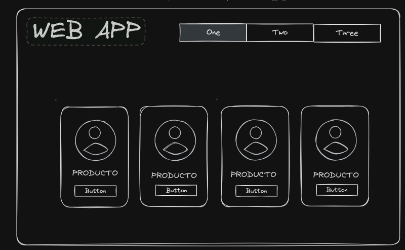

# Ejercicio clase 3
- Una pagina con su propio css (tiene que estar en una carpeta aparte)
- Pagina sobre principal
- Pagina de productos
- Pagina de carrito
- Pagina de contacto
- Pagina de login

# Ejercicio clase 5
*Lo han contratado para hacer la wiki de Recode the future, el cliente pide una pagina simple donde estara en la principal información basica de programación web, en otra pagina información sobre un lenguaje de programación y una tercera sobre un framewrok*
- Se debe tener una estructura de carpetas (una carpeta public con la carpeta de los estilos y otra para las imagenes)
- Un archivo index.html donde se tendra la pagina principal
- una carpeta llamada pages donde estaran las otras 2 paginas solicitadas 

# Evaluación 
*Lo han contratado para diseñar la pagina web para un nuevo FoodTruck en la ciudad de medellín, el cliente quiere una pagina web donde se presente el proyecto FoodTruck medellín, su menu de comida rapida, y un apartado de redes sociales.* 

*El cliente proporciona las imagenes de su menu de comida, su marca y  la lista de precios del menu*

- Comida rapida
    - Hamburguesa con queso 5$
    - HotDog 3$
    - papas con chili 4.50$
- Bebidas
    - Malteada de chocolate 4$
    - Gaseosa 2$
    - Limonada 1$

(Tiempo de duración 2 horas)

## _Criterios de aceptación_
- _5 puntos_ ) La pagina debe seguir la jerarquia de carpetas vista en clase.

- _5 puntos_ ) La pagina debe ser semantica.

- _5 puntos_ ) Diseño de la pagina.

- **_5 puntos extras_** ) La pagina este en un repositorio de github.

## Ejecrcio 
Crear un blog con tarjetas de articulos y un footer con redes sociales

## Premio
*Has sido contratado para crear el sitio web de Code for Tomorrow. El cliente solicita una página sencilla donde en la principal se encuentre información básica sobre desarrollo de software, en otra página información sobre un sistema operativo y una tercera sobre una base de datos.*
- Debes tener una estructura de carpetas (una carpeta llamada public con subcarpetas para los estilos y otra para las imágenes)
- Un archivo index.html donde se tendrá la página principal
- Una carpeta llamada pages donde estarán las otras 2 páginas solicitadas

Espero que esto te sea útil. ¡Buena suerte con tu tarea! 😊

## Ejercicio Clase 10
Les piden diseño de una pagina web para una empresa de venta de productos de limpieza y quieren que se siga la siguiente estructura. SE ENTEGA EN GITHUB

- La pagina debe seguir la jerarquia de carpetas vista en clase.

- La pagina debe ser semantica.

- Diseño de la pagina (No es necesario que sea responsive) Pero debe seguir los conceptos de UX/UI vistos en clase.
